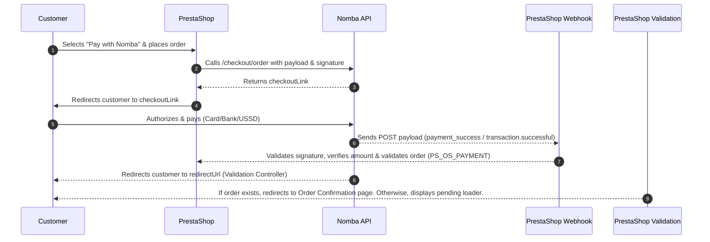
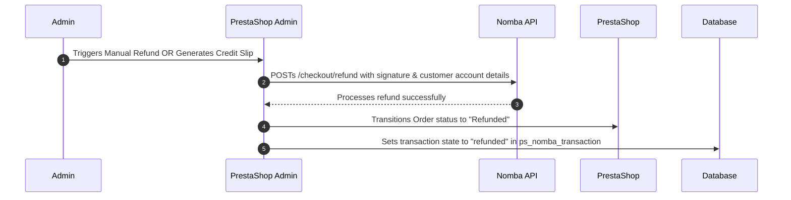

# Nomba Checkout Module for PrestaShop

Accept payments securely via the **Nomba Checkout API** in your PrestaShop store. This module integrates seamlessly with the PrestaShop checkout workflow, providing customers with payment options including Cards, Bank Transfers, and USSD. It also supports automated and manual refund processing directly from the PrestaShop admin dashboard.

---

## Features

- **Seamless Redirection Checkout**: Directs customers to a secure checkout hosted payment page on Nomba.
- **Webhook Integration**: Asynchronously validates transactions and creates orders upon receipt of payment success payloads from Nomba, preventing orders from dropping due to closed browsers.
- **Pending/Validation Fallback**: A validation front controller handles status redirection checks and displays a pending screen if the webhook has not yet processed the transaction.
- **Refund Support**:
  - **Manual Refunds**: Processed directly from the back-office order details screen.
  - **Automated Hook-based Refunds**: Triggered automatically when a PrestaShop credit slip (refund slip) is generated.
- **Idempotency Guard**: Prevents duplicate refund calls by validating the transaction state inside the local database.
- **Logging & Diagnostics**: Detailed logging of webhooks and API calls to `webhook.log` and the PrestaShop system logs.

---

## Technical Specifications & Requirements

- **PHP Version**: `^8.1`
- **PrestaShop Version**: `^8.0` (Bootstrap back-office style compliant)
- **API Dependencies**: PHP `curl` extension enabled, SSL enabled (for production webhook deliveries).

---

## Installation Guide

1. **Pack the Module**: Compress the `nomba` directory into a `.zip` archive (ensure the folder name inside is `nomba`).
2. **Upload to PrestaShop**:
   - Go to your PrestaShop back office.
   - Navigate to **Modules** → **Module Manager**.
   - Click **Upload a module** and select your `nomba.zip` archive.
3. **Configure the Module**: Once installed, click **Configure** on the Nomba module card or navigate to **Payment** → **Nomba**.

---

## Configuration Settings

Under the **Nomba Checkout Settings** in the module configuration, provide the following parameters:

| Configuration Key   | Title       | Description                                                                                                                        | Required |
| ------------------- | ----------- | ---------------------------------------------------------------------------------------------------------------------------------- | -------- |
| `NOMBA_LIVE_MODE`   | Live Mode   | Check to toggle production environment (`https://api.nomba.com/v1`). Uncheck for Sandbox/Testing (`https://sandbox.nomba.com/v1`). | Yes      |
| `NOMBA_CLIENT_ID`   | Client ID   | The Client ID issued by your Nomba developer settings interface.                                                                   | Yes      |
| `NOMBA_ACCOUNT_ID`  | Account ID  | The Account ID issued by Nomba, passed as a header parameter (`accountId`).                                                        | Yes      |
| `NOMBA_PRIVATE_KEY` | Private Key | The cryptographic Client Secret key used for API authentication and hashing.                                                       | Yes      |

_Note: In the configuration view, copy the displayed **Webhook URL** and configure it in your Nomba merchant portal dashboard._

---

## System Integration Architecture

### 1. Payment Flow



### 2. Refund Flow



---

## Database Schema

The module creates a tracking table `ps_nomba_transaction` during the installation phase:

```sql
CREATE TABLE IF NOT EXISTS `ps_nomba_transaction` (
    `id_nomba_transaction` INT(11) NOT NULL AUTO_INCREMENT,
    `id_cart` INT(11) NOT NULL,
    `id_order` INT(11) DEFAULT NULL,
    `nomba_order_id` VARCHAR(255) NOT NULL,
    `nomba_order_reference` VARCHAR(255) NOT NULL,
    `amount` DECIMAL(20,6) NOT NULL,
    `account_number` VARCHAR(20) DEFAULT NULL,
    `bank_code` VARCHAR(10) DEFAULT NULL,
    `status` VARCHAR(50) NOT NULL,
    `date_add` DATETIME NOT NULL,
    `date_upd` DATETIME NOT NULL,
    PRIMARY KEY (`id_nomba_transaction`),
    KEY `id_cart` (`id_cart`),
    KEY `id_order` (`id_order`)
) ENGINE=InnoDB DEFAULT CHARSET=utf8;
```

- **account_number** & **bank_code**: Stored securely to automate the bank-destination payment routing on subsequent refund requests.
- **status**: Indicates `completed` or `refunded` states to prevent double-refunding.

---

## Logging & Debugging

- **Webhook Raw Log**: Webhook hit details, including request payloads, header variables, and state updates are saved locally at `modules/nomba/webhook.log`.
- **System Logs**: Integration errors and security violations are logged directly to the PrestaShop native log database and can be reviewed under **Configure** → **Advanced Parameters** → **Logs** in your administration panel.
