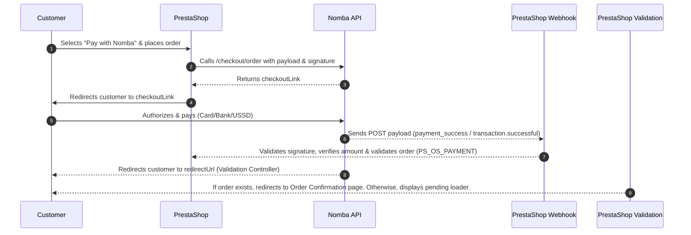
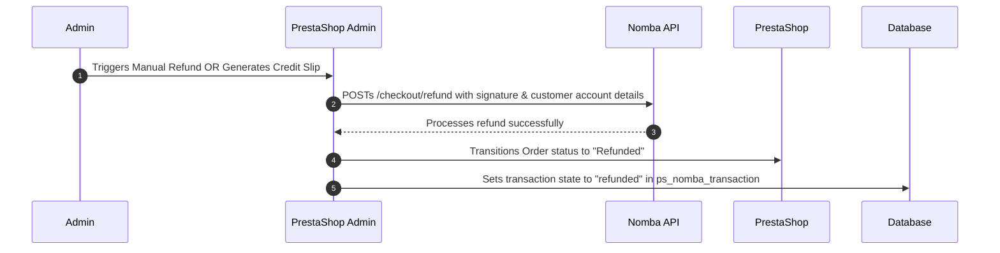

# Nomba Checkout Module for PrestaShop

Accept payments securely via the **Nomba Checkout API** in your PrestaShop store. This module integrates seamlessly with the PrestaShop checkout workflow, providing customers with payment options including Cards, Bank Transfers, and USSD. It also supports automated and manual refund processing directly from the PrestaShop admin dashboard.

---

## 🔑 Credentials Reference (Developer Reference)

To assist developers in setting up, maintaining, or debugging this installation, use this section to record environment configurations.

> [!WARNING]
> Keep this file secure if it contains active credentials. Never commit production keys to public git repositories.

### Demo Video for the Project

- **Google Drive Video**: `https://drive.google.com/file/d/1WBTY6KxM7LiC80cXt2mqwDrqh8h1R2Lj/view?usp=sharing`

### PrestaShop Admin Backoffice Login

- **Admin Front URL**: `https://nombastore.dunbi.xyz/`
- **Admin Backoffice URL**: `https://nombastore.dunbi.xyz/admin373nuwyqncgq2w1oqau/`
- **Admin Email/Username**: `mokwechibuike7@gmail.com`
- **Admin Password**: `Favorite1997#`

### Nomba API Client Credentials (Test Environment)

- **Account ID (Parent Account)**: `f666ef9b-888e-4799-85ce-acb505b28023`
- **Account ID (Sub-Wallet)**: `080efc96-b3b1-46e5-bb39-069ac5089956`
- **Nomba Webhook Signature Key**: `NombaHackathon2026`

- **Mode**: Sandbox/Test Mode (`NOMBA_LIVE_MODE = 0`)
- **Client ID**: `706df6c4-b8bb-4130-88c4-d21b052f8631`
- **Private Key (Client Secret)**: `k8UobYk3APgOoxUnNL7VpuxzwTsH4LsXtydfjcHs8RH0YISBB4OMqJsaafG+U8fWETu9YZ96bNXE+DelCDuMPw==`

### Nomba API Client Credentials (Live/Production Environment)

- **Mode**: Live Mode (`NOMBA_LIVE_MODE = 1`)
- **Client ID**: `e5e85b13-f560-4643-814e-c87435dbbc15`
- **Private Key (Client Secret)**: `8/doS7Q3w77EANpk3vpgSrc05hhOiRWp3eBs01sXyZ1AmovtZUXlmrxie+xnEF2tR4q79t0IFufMD1d4JrkT8g==`

## Features

- **Seamless Redirection Checkout**: Directs customers to a secure checkout hosted payment page on Nomba.
- **Webhook Integration**: Asynchronously validates transactions and creates orders upon receipt of payment success payloads from Nomba, preventing orders from dropping due to closed browsers.
- **Pending/Validation Fallback**: A validation front controller handles status redirection checks and displays a pending screen if the webhook has not yet processed the transaction.
- **Refund Support**:
  - **Manual Refunds**: Processed directly from the back-office order details screen.
  - **Automated Hook-based Refunds**: Triggered automatically when a PrestaShop credit slip (refund slip) is generated.
- **Idempotency Guard**: Prevents duplicate refund calls by validating the transaction state inside the local database.
- **Logging & Diagnostics**: Detailed logging of webhooks and API calls to `webhook.log` and the PrestaShop system logs.

---

## Technical Specifications & Requirements

- **PHP Version**: `^8.1`
- **PrestaShop Version**: `^8.0` (Bootstrap back-office style compliant)
- **API Dependencies**: PHP `curl` extension enabled, SSL enabled (for production webhook deliveries).

---

## 📦 Packaging & Installation Guide

To deploy this module on a PrestaShop store, follow these steps:

### Step 1: Zip the Module

Before uploading, the module must be compiled and packaged into a ZIP archive:

1. **Resolve Dependencies**: Ensure that composer dependencies are installed and the autoloader is generated. In the root directory of the `nomba` module, run:
   ```bash
   composer install --no-dev --optimize-autoloader
   ```
2. **Compress Folder**: Zip the `nomba` directory.
   - **Important**: The parent folder inside the ZIP file **must** be named exactly `nomba` (e.g., extracting the ZIP should result in a folder named `nomba` containing `nomba.php`, etc., not flat files at the ZIP root or a folder like `nomba-master`).
   - You can run the following command in your terminal from the `modules/` directory:
     ```bash
     zip -r nomba.zip nomba
     ```

### Step 2: Upload to PrestaShop

1. Log in to your PrestaShop **Admin Back-Office**.
2. From the left sidebar, navigate to **Modules** → **Module Manager**.
3. At the top-right of the page, click the **Upload a module** button.
4. Drag and drop your compiled `nomba.zip` file, or select it from your file browser.
5. PrestaShop will upload and automatically extract/install the module. Once complete, you will see a success message.

---

## ⚙️ Configuration Settings

Once the module is installed, you need to configure the API credentials and set up the webhooks to handle payments and refunds correctly.

### Step 1: Open the Module Configuration

- Click **Configure** on the Nomba module card inside the Module Manager.
- Alternatively, go to **Payment** → **Nomba** in the side navigation menu.

### Step 2: Input API Credentials

In the **Nomba Checkout Settings** panel, configure the following fields:

| Field Name      | Configuration Key   | Description                                                                                                                            | Required |
| :-------------- | :------------------ | :------------------------------------------------------------------------------------------------------------------------------------- | :------- |
| **Live Mode**   | `NOMBA_LIVE_MODE`   | Toggle to enable production environment (`https://api.nomba.com/v1`). Disable to use Sandbox/Testing (`https://sandbox.nomba.com/v1`). | Yes      |
| **Client ID**   | `NOMBA_CLIENT_ID`   | The Client ID issued by your Nomba developer settings interface.                                                                       | Yes      |
| **Account ID**  | `NOMBA_ACCOUNT_ID`  | The Account ID issued by Nomba, passed as a header parameter (`accountId`).                                                            | Yes      |
| **Private Key** | `NOMBA_PRIVATE_KEY` | The cryptographic Client Secret key used for API authentication and signature hashing.                                                 | Yes      |

_Click **Save** to apply the configuration._

### Step 3: Configure Callback and Webhook URLs

At the bottom of the configuration screen under the **Nomba URL Configuration** panel, the module displays two dynamic URLs generated for your store:

1. **Webhook URL** (e.g., `https://yourstore.com/module/nomba/webhook`):
   - **Action**: Copy this URL and log in to your **Nomba Merchant Dashboard**.
   - **Navigation**: Navigate to **Settings** → **Webhooks** and paste this URL into the Webhook URL field.
   - **Purpose**: This enables Nomba to notify your store asynchronously of successful payments, resolving checkout browser close errors.
2. **Redirect URL** (e.g., `https://yourstore.com/module/nomba/validation`):
   - **Action**: Copy this URL and paste it as the `callbackUrl` in your Nomba account settings or Checkout API integration options.
   - **Purpose**: This is where customers return after completing their payment to verify their order status.

---

## 🛒 How to Use the Module

### 1. Customer Checkout Experience

- On the checkout page, customers will see **Pay with Nomba** under the available payment options.
- The payment option lists **Card, Bank Transfer, USSD** as accepted payment channels.
- When they select Nomba and click "Place Order", they are redirected to a secure payment page hosted by Nomba.
- Upon completion (or failure/cancellation), they are redirected back to the store's Redirect URL, which presents a loading validation screen until webhook verification completes, and then redirects them to the native PrestaShop **Order Confirmation** page.

### 2. Processing Refunds

The module supports refunding transactions using two distinct flows:

#### Flow A: Manual Back-Office Refund (Recommended)

Use this option when you want to initiate a full refund directly to the customer's bank account:

1. Go to **Orders** → **Orders** and select the order that was paid via Nomba.
2. Scroll down to find the **Nomba Refund** pane.
3. If the payment details (bank code and account number) were successfully captured during checkout:
   - Click the **Process Refund via Nomba API** button.
   - Confirm the prompt. The module will trigger an API call to Nomba to refund the full order total directly to the customer's bank account, update the order status to **Refunded**, and write a private comment to the order history.
4. If payment details were _not_ captured (e.g., bank transfer details were not saved or manual handling is needed):
   - The pane will display a warning: `Manual Refund Required. Bank details not captured.`
   - Copy the displayed **Transaction Reference** and click **Open Nomba Dashboard** to perform a manual refund inside the Nomba portal.

#### Flow B: Automated Hook Refund (Credit Slips)

Use this option when processing partial or standard PrestaShop refunds:

1. On the Order Details page, click **Standard Refund** or **Partial Refund** at the top bar.
2. Select the items/quantities to refund and check the **Generate a credit slip** option.
3. Complete the refund inside PrestaShop.
4. The module's background hook (`actionOrderSlipAdd`) will intercept the credit slip generation and automatically call the Nomba Refund API to send the designated refund amount back to the customer's captured bank account.

---

## System Integration Architecture

### 1. Payment Flow



### 2. Refund Flow



---

## Database Schema

The module creates a tracking table `ps_nomba_transaction` during the installation phase:

```sql
CREATE TABLE IF NOT EXISTS `ps_nomba_transaction` (
    `id_nomba_transaction` INT(11) NOT NULL AUTO_INCREMENT,
    `id_cart` INT(11) NOT NULL,
    `id_order` INT(11) DEFAULT NULL,
    `nomba_order_id` VARCHAR(255) NOT NULL,
    `nomba_order_reference` VARCHAR(255) NOT NULL,
    `amount` DECIMAL(20,6) NOT NULL,
    `account_number` VARCHAR(20) DEFAULT NULL,
    `bank_code` VARCHAR(10) DEFAULT NULL,
    `status` VARCHAR(50) NOT NULL,
    `date_add` DATETIME NOT NULL,
    `date_upd` DATETIME NOT NULL,
    PRIMARY KEY (`id_nomba_transaction`),
    KEY `id_cart` (`id_cart`),
    KEY `id_order` (`id_order`)
) ENGINE=InnoDB DEFAULT CHARSET=utf8;
```

- **account_number** & **bank_code**: Stored securely to automate the bank-destination payment routing on subsequent refund requests.
- **status**: Indicates `completed` or `refunded` states to prevent double-refunding.

---

## Logging & Debugging

- **Webhook Raw Log**: Webhook hit details, including request payloads, header variables, and state updates are saved locally at `modules/nomba/webhook.log`.
- **System Logs**: Integration errors and security violations are logged directly to the PrestaShop native log database and can be reviewed under **Configure** → **Advanced Parameters** → **Logs** in your administration panel.

---

## 📂 File & Directory Structure

Here is an overview of the key codebase elements for developers:

```
nomba/
├── controllers/
│   ├── admin/
│   │   ├── AdminNombaController.php       # Handles configuration settings panel in backoffice
│   │   └── AdminNombaRefundController.php # Manages backoffice manual refund processing (native/transfer)
│   └── front/
│       ├── payment.php                   # Initiates order checkout and redirects customer to Nomba
│       ├── validation.php                # Front controller to verify transaction status (fallback mechanism)
│       └── webhook.php                   # Webhook endpoint handling success and refund events asynchronously
├── src/
│   └── Service/
│       └── NombaApiClient.php            # Main API wrapper class for token auth, checkout creation, refunds, & signature checks
├── sql/
│   └── install.sql                       # Place for static SQL schema additions (dynamic schema created inside nomba.php)
├── views/
│   └── templates/
│       ├── admin/
│       │   ├── order_refund.tpl          # Smarty template rendering the Nomba Refund pane in order details
│       │   └── webhook_info.tpl          # Smarty template rendering the guide in config panel
│       └── front/
│           └── pending.tpl               # Smarty template displaying pending payment screen with auto-polling
├── nomba.php                             # Entrypoint module class managing install, hooks, and views injection
└── README.md                             # Integration guide and configuration reference
```
